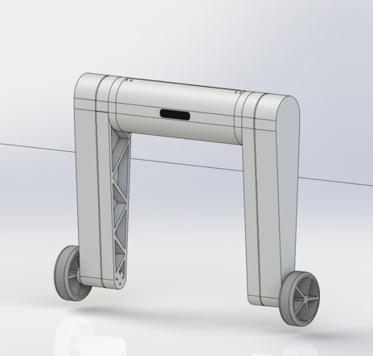
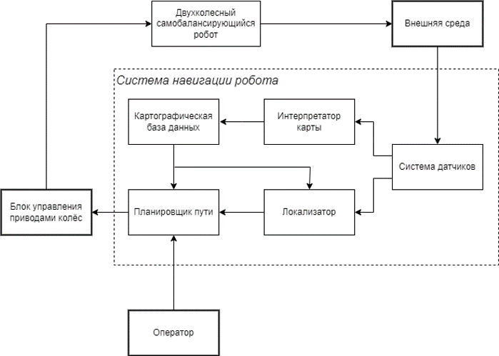
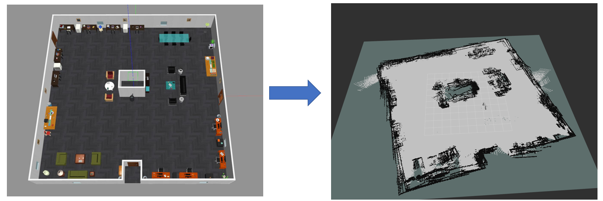
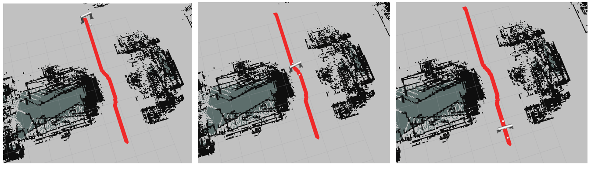
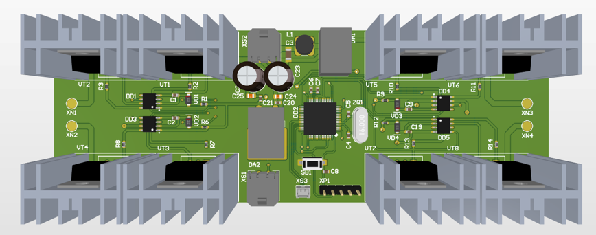

# DiplomaRobot
Данный проект был разработан в ходе выполнения моей бакалавроской работы по теме "Разработка системы управления двухколесного самобалансирующегося робота". Робот предназначен для перевозки грузов из одной точки в другую в складском помещении и является аналогом робота ["evoBot"](https://www.iml.fraunhofer.de/en/fields_of_activity/material-flow-systems/iot-and-embedded-systems/evobot.html). Поднимать грузы позволяет роботу наличие второго звена в виде рук. 

Робот имеет следующие параметры:
| Параметр    | Значение   |
|-------------|------------|
| Вес робота      | 8.5 кг |
| Длина каждого звена       | 0.68 м |
| Максимальная высота робота       | 1.3 м |
| Ширина робота       | 0.78 м |
| Радиус колеса       | 0.12 м |

<div align="center">
    
</div>

В рамках данной работы были выпонены сделующие задачи:
1. Проведен синтез системы управления двухколесного самобалансирующегося робота, который обеспечивает его стабилизацию; 
2. Разработана плата управления приводами колес двухколесного самобалансирующегося робота, которая получает с датчиков данные об угле поворота колес и угле наклона робота;
3. Разработана система навигации двухколесного самобалансирующегося робота на базе **ROS** и с использованием камеры глубины **Intel RealSense D435**;
4. Протестирована работа системы навигации двухколесного самобалансирующегося робота в симуляторе **Gazebo**.

## ControlSystem
В этой директории содержатся файлы **Matlab** и **Sumilink** для ситеза и исследования системы управления робота при его нижнией конфигурации. В ходе синтеза в качестве корректирующего устройства был выбран линейно-квадратичный регулятор и были определены его коэффициенты. Были рассмотрены три разные системы: линейная, нелинейная и дискретная системы. В результате каждая из этих систем удовлетворяет поставленному в работе ТЗ.

## NavigationSystem
Cистема навигации должна выполнять такие задачи, как картографирование (построение карты рабочей местности), локализация (определение своего местоположения на карте) и планирование пути до точки назначения. Исходя из этого была составлена функциональная схема системы:
<div align="center">
    
</div>

В качестве аппаратной части системы была выбрана камеры глубины **Intel RealSense D435**, которая позволяет построить более детальную карту местности. Для реализации программной части в качестве был выбран фреймворк **ROS Noetic** на Ubuntu 20.04, и были выбраны следующие алгоритмы для решения основных задач навигации: 

1. Метод SLAM **RTAB-Map**, который полностью совместим с выбранной камерой глубины 
2. Алгоритм **А*** для глобального планирования пути, который является улучшенной версией алгоритма Дейкстры и более эффективной. 
3. Алгоритм **DWA** для локального планирования пути, который является наиболее эффективным  за счет того, что он учитывает динамику робота и его ограничения по скорости и ускорению.
   
### Инструкция по запуску:
1) В терминале из пакета *diploma_self_balancing_robot* запустить launch-файл *gazebo.launch* для открытия Gazebo с моделью робота:
   
   ```roslaunch diploma_self_balancing_robot gazebo.launch```
2) Из того же пакета запустить launch-файл *display.launch* для открытия Rviz с моделью робота:
   
   ```roslaunch diploma_self_balancing_robot display.launch```
3) Открыть новый терминал и из пакета *rtab_package* запустить launch-файл *rtab_launch.launch* для запуска ноды *rtabmap*:

   ```roslaunch rtab_package rtab_launch.launch```
4) Включить в Rviz отображение Map, открыть новый теримнал и запустить ноду *teleop_twist_keyboard.py* для управления роботом через клавиатуру ПК:

    ```rosrun teleop_twist_keyboard teleop_twist_keyboard.py```
   
    Затем обкатить робота по всей рабочей зоны до построения полной карты и отключить rtbamap.
5) В терминале для *rtabmap* запустить его заново, но с изменённым аргументом *localization*:

   ```roslaunch rtabmap_ros rtabmap.launch localization:=true```
6) Открыть новый терминал и запустить из пакета *move_base_package* launch-файл *move_base.launch*:

   ```roslaunch move_base_package move_base.launch```
7) В Rviz с помощью инструмента *2D Nav Goal* на построенной карте назначить точку, в которую должен переместиться робот.
8) Наблюдать за его перемещением :)

### Демонстрация работы системы навигации
На изображении ниже приведен пример построенной двухмерной карты рабочей местности с помощью *rtabamap*:
<div align="center">
    
</div>
На следующем изображении показан пример автономного перемещения робота по глобальному пути, построенному через *move_base*:
<div align="center">
    
</div>

## DriveControlBoard
Плата предназначена для управления приводами колес двухколесного самобалансирующегося робота. На плате находятся два H-моста для каждого привода и МК STM32, который, получая данные с датчиков MPU 6050 и AS5048B по интерфейсу I2C, формирует сигнал для управления приводами через усилители мощности. Общение микроконтроллера с датчиками должно проходить по принципу “master-slave”. 
В ходе работы были рассчитаны силовые мосты, подобраны электрические компоненты, составлена принципиальная схема, спроектирована печатная плата в программе Altium Designer и разработана конструкторская документация. 
<div align="center">
    
</div>
